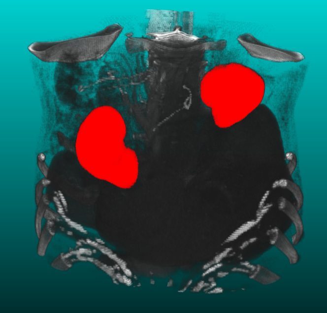
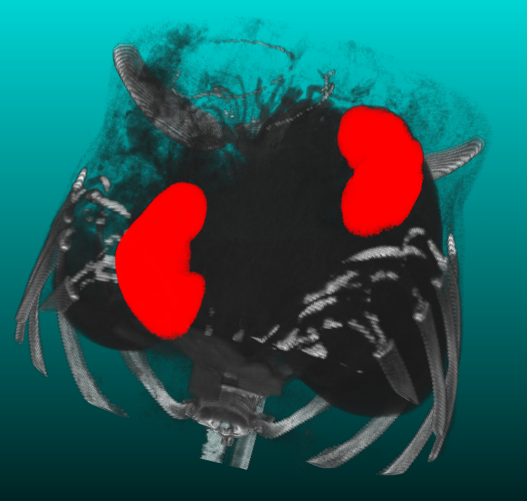

# Segmentation visualization using itk-vtk

## Authors

* louis.guo
* aymeric.fages
* ilan.guenet

## ITK/VTK Versions

```
itk==5.2.0.post3
itk-core==5.2.0.post3
itk-filtering==5.2.0.post3
itk-io==5.2.0.post3
itk-numerics==5.2.0.post3
itk-registration==5.2.0.post3
itk-segmentation==5.2.0.post3
vtk==9.0.1
```

## Script

`main.py` with two steps:
* kidneys segmentations (function: `segment`)
* volumes rendering (function: `render`). Overlap the segmented volumes over the volume.

Usage:

`python3 main.py`
## Output




